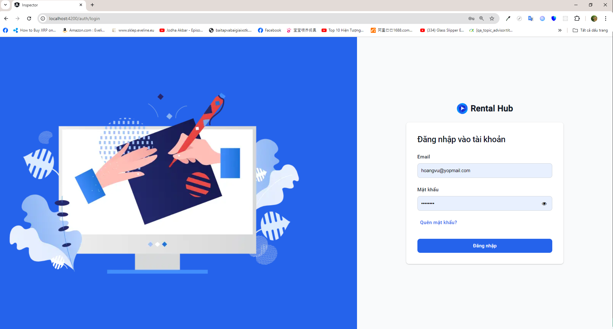
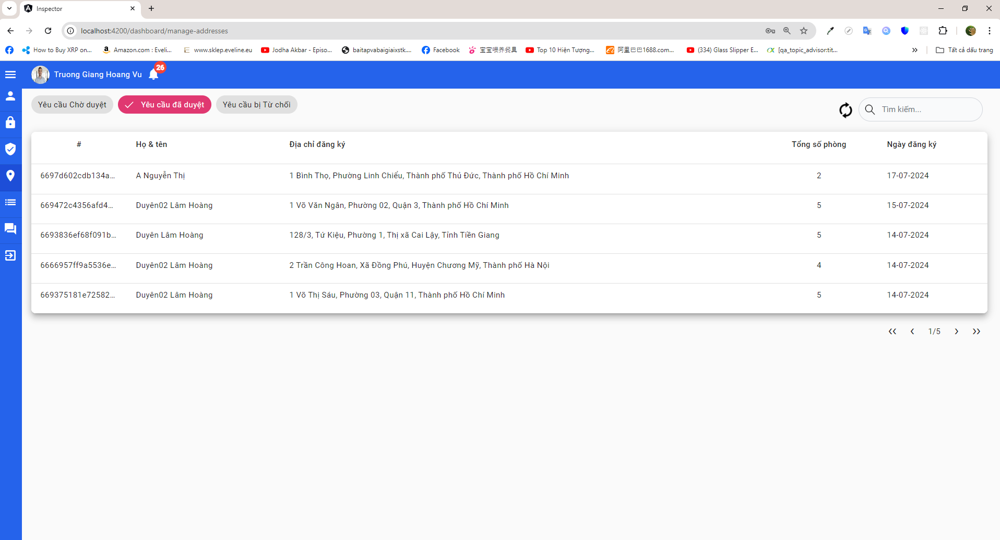
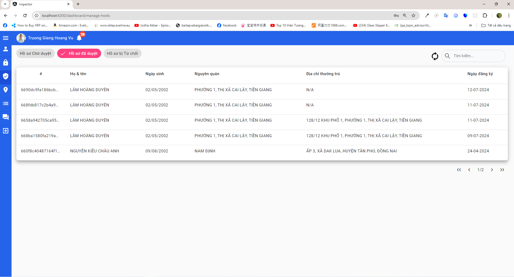
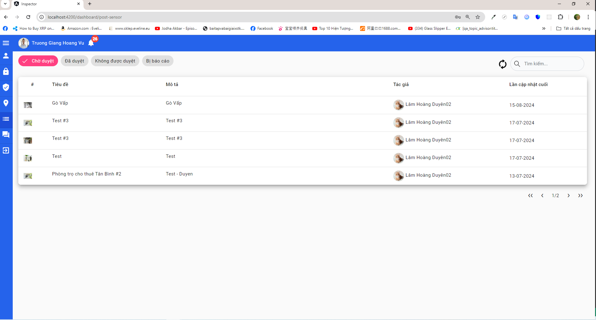
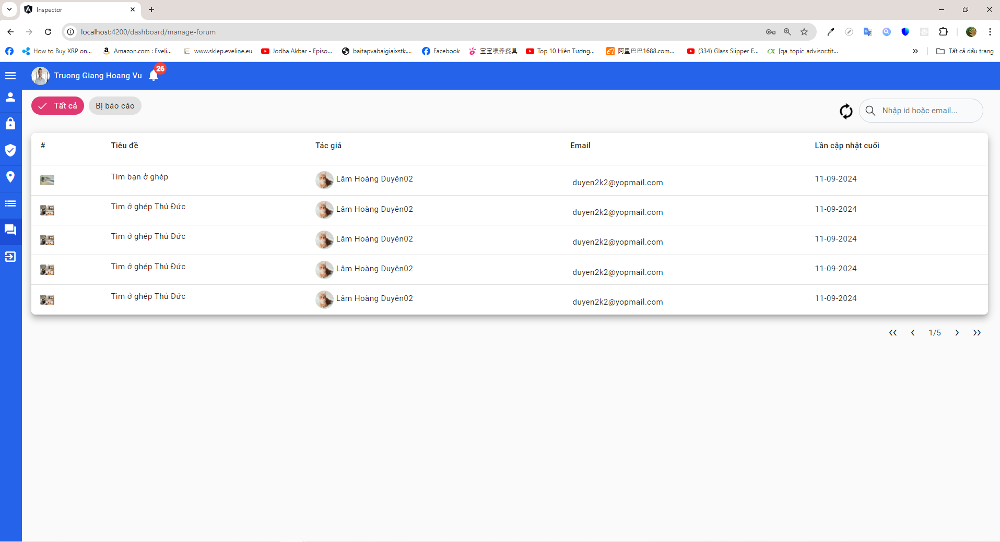

# Introduction
- This repo is one of three websites included in my graduation thesis (Basically, it's a platform where people go to search for rental apartments. There are three main roles: Users/Hosts looking for rental flats or rental homeowners wanting to let apartment seekers know of their places. The management roles are inspector and admin with the main functions to sensor posts from hosts).
- The other repo for the user website can be found here <a href='https://github.com/nguyenkieuchauanh0908/FE_RentalHubAdmin'>Admin</a>, <a href='https://github.com/nguyenkieuchauanh0908/RentalHubFE'>Customers</a>
- Before cloning and running this repo, make sure to clone and run the <a href='https://github.com/nguyenkieuchauanh0908/RentalHubBE'>backend server</a>
- You can also find the demo video <a href='https://youtu.be/-Bspym1C5Fw'>here</a>
# Technology
- Angular v16.2.0
- NodeJS v18.16.1
- ExpressJS
- MongoDB
- Authentication with JSON Web Token (using Refresh Token and Access Token)
- RESTful APIs

# System Architechture

# Main Features
- Inspectors can manage users, employees, posts, hosts, forum
  ...

# Installation
- To run this repo, follow the steps:
 1. Clone this repo and open the terminal (make sure the directories point to the project included in this repo)
 2. Open the project and run <pre><code>npm install</code></pre> to install all necessary libraries or packages. In case there are any warnings due to deprecated versions of some libraries, you can also run <code>npm install --force</code></pre> and ignore them
 3. Run <pre><code>ng serve --port 4200</code></pre> (You can also run on port 4201 or 4202 as long as they must not be duplicated if you run more than two front-end servers at the same time )
 4. Open the browser at http://localhost:4200/ (or http://localhost:4201/ or http://localhost:4202/ with 4200/4201/4202 as the port of your choice)
 # Testing Account
1.  Demo account for users
    - email: chauanh@yopmail.com
    - password: chauanh@123
2. Demo account for admin:
    - email: 20110234@student.hcmute.edu.vn
    - password: chauanh@123
3. Demo account for inspector:
    - email: hoangvu@yopmail.com
    - password: duyen59@
4. Demo VNPay account <a href='https://sandbox.vnpayment.vn/apis/vnpay-demo/'>here</a>

# Snapshot Previews
1. Login Page
   
    

2. Manage Addresses
   
    
    
3. Manage Hosts

    
   
4. Manage Posts

    

 5. Manage Forum

    

 

